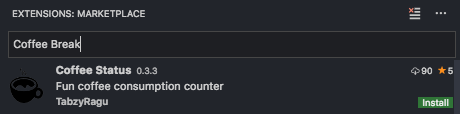

# Installation

## Install Visual Studio Code

Go to [Visual Studio Code pages](https://code.visualstudio.com/) and download the latest version for your operating system.

## Install the Coffee Break plugin

Run Visual Studio Code and install the Coffee Break extension by doing the following

- choose View -> Extensions from the menu (or press Shift-Ctrl-X, Shift-Cmd-X on Mac)
- search for Coffee Break
- tap the Install button

NOTE: The extension "Markdown All In One" will be installed as well. It greatly improves Markdown writing in VS Code.
